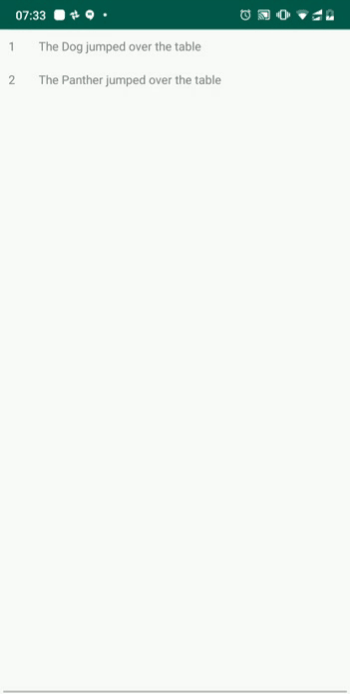

# LiveData
An simple android app to demonstrate how [LiveData](https://developer.android.com/topic/libraries/architecture/livedata) can be used with the MVP architecture 

The approach is to create dummy data periodically and use LiveData to update the UI accordingly. The presenter starts off with an empty list of data items and adds new dummy items every second until the items in the list add up to 10, then clears the list and repeats the process. The view (Activity) observes the data using LiveData and updates the UI with the live data in the list.

